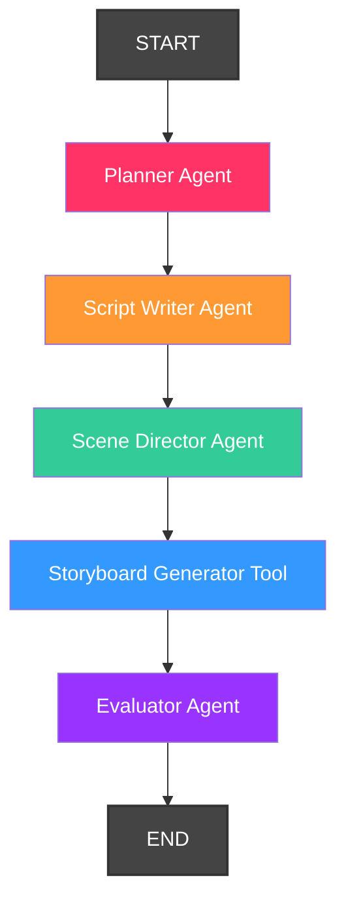

# Forge AI 🎬 — Narrative to Visual Story Agent

## Overview

Forge AI is a multi-agent orchestrated system designed to transform a free-form narrative into a comprehensive, visually rich movie production plan. Through an automated pipeline, an initial raw story string is systematically converted into a story blueprint, a professional script, a detailed director's scene plan, and an AI-generated image storyboard.

## System Architecture

The project leverages a multi-agent system built entirely on **LangGraph**. The backend uses **FastAPI** to expose production-ready REST endpoints, while the frontend is a beautifully themed **Streamlit** dashboard intended for a dark cinematic studio aesthetic.

### Architecture Diagram



## Setup Instructions

1. **Clone the repository**:
   ```bash
   git clone <repo_url>
   cd storyforge-ai
   ```

2. **Install requirements**:
   ```bash
   pip install -r requirements.txt
   ```

3. **Environment Setup**:
   Copy the example environment variables file and insert your API key:
   ```bash
   cp .env.example .env
   # Edit .env and set OPENAI_API_KEY
   ```

## How to Run Locally

### Approach 1: Streamlit Frontend Only
Because the workflow uses LangGraph components, you can invoke the workflow securely via Streamlit directly:
```bash
streamlit run app.py
```

### Approach 2: FastAPI Backend Server
If integrating into a broader system, serve the workflow using Uvicorn:
```bash
uvicorn api:app --reload
```
You can access the auto-generated Swagger docs at `http://localhost:8000/docs`.

## Deployment

### HuggingFace Spaces Deployment target (Streamlit)
To deploy on HuggingFace Hub:
1. Create a new Space on [HuggingFace](https://huggingface.co/spaces) and select **Streamlit** as your SDK.
2. Push the files in this repository to the space.
3. Define the `OPENAI_API_KEY` in the Space's Repository Secrets setting under settings.
4. HuggingFace will auto-detect `app.py` and run it via `requirements.txt`.
